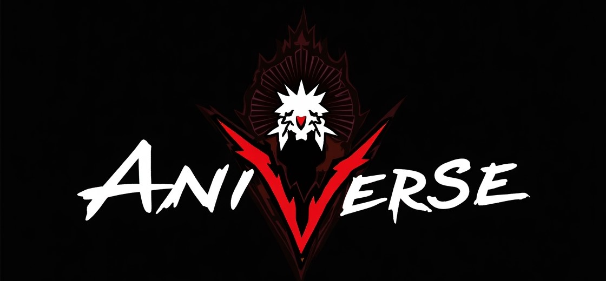
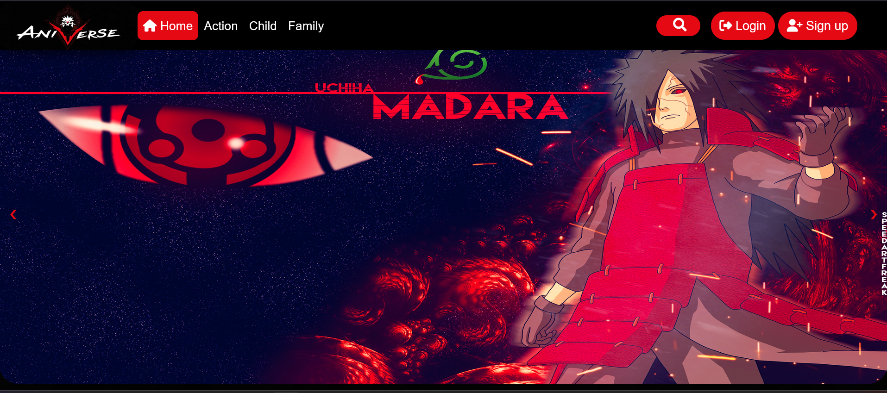
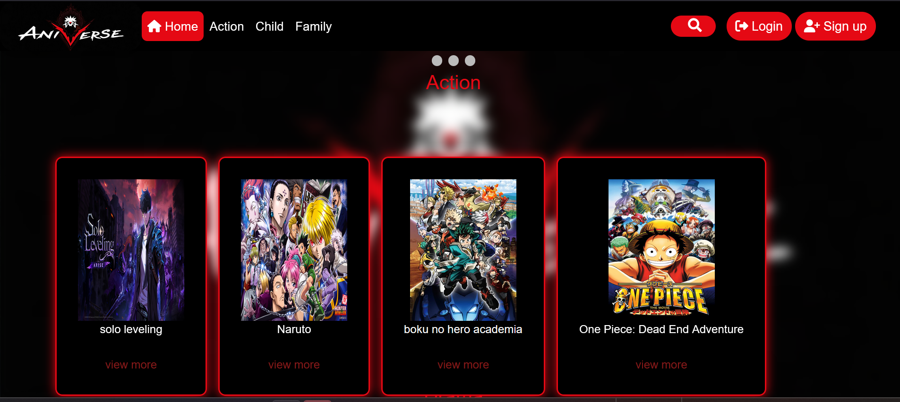
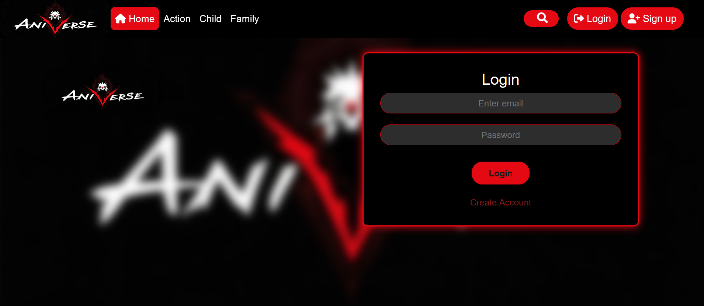
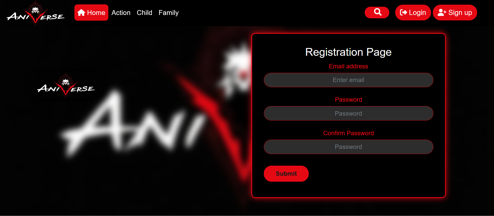
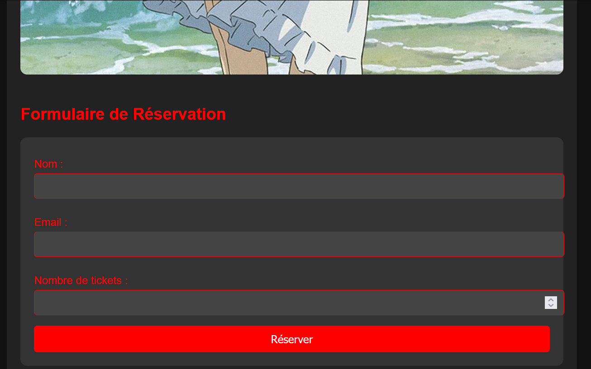
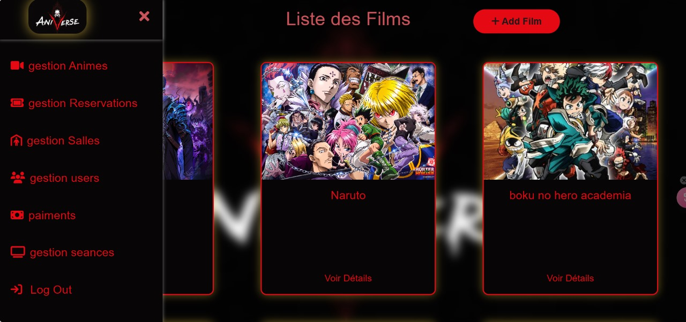
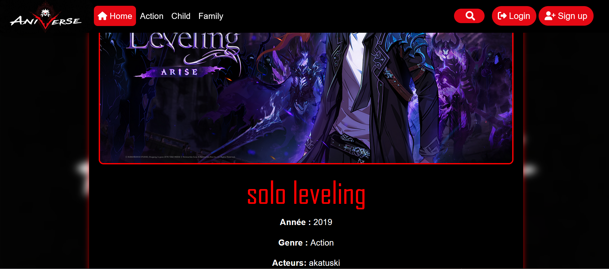

# 🎬 AniVerse - Plateforme de Réservation de Billets de Cinéma pour les Films d’Animation
###  Logo App

**AniVerse** est une application web moderne dédiée à la réservation de billets de cinéma, spécialisée dans les films d’animation japonais et internationaux. Développée dans le cadre d’un projet académique, cette plateforme offre une expérience fluide et interactive pour les amateurs d’animes et de cinéma d’animation.

---

## 📌 Sommaire

- [🎯 Objectif du projet](#-objectif-du-projet)
- [✨ Fonctionnalités](#-fonctionnalités)
- [🧠 Architecture & Design](#-architecture--design)
- [🛠️ Technologies utilisées](#-technologies-utilisées)
- [🚀 Installation et Lancement](#-installation-et-lancement)
- [📁 Structure du Projet](#-structure-du-projet)
- [🧪 Tests](#-tests)
- [🔧 CI/CD et DevOps](#-cicd-et-devops)
- [🖼️ Captures d’écran](#-captures-décran)
- [👩‍💻 Auteur](#-auteur)
- [📜 Licence](#-licence)
- [🤝 Contribution](#-contribution)

---

## 🎯 Objectif du projet

Créer une solution de réservation en ligne pour les séances de films d’animation, intégrant les fonctionnalités modernes d’authentification, visualisation des films, sélection de sièges, et un système de notifications en temps réel.

---

## ✨ Fonctionnalités

- 🔐 Authentification et inscription sécurisées
- 🎞️ Catalogue de films animés avec synopsis, bande-annonce et horaires
- 🎟️ Réservation de places avec affichage graphique de la salle
- 🧑‍💼 Tableau de bord administrateur : ajout/suppression de films et gestion des séances
- 📦 Système de gestion des réservations utilisateurs
- 📩 Notifications par email après réservation
- 🌐 Interface multilingue (FR/EN)
- 📱 Responsive Design

---

## 🧠 Architecture & Design

Architecture MVC (Model - View - Controller) avec séparation claire des responsabilités :

- **Model** : gestion des entités (Films, Réservations, Utilisateurs)
- **View** : pages JSP dynamiques avec CSS/JS intégré
- **Controller** : servlets Jakarta EE assurant la logique métier

---

## 🛠️ Technologies utilisées

| Technologie         | Rôle dans le projet                     |
|---------------------|------------------------------------------|
| Jakarta EE| Backend et logique métier                |
| JSP                 | Frontend (pages dynamiques)              |
| MySQL               | Base de données relationnelle            |
| JDBC                | Communication entre Java et MySQL        |
| HTML/CSS/JavaScript | UI/UX Design                             |
| GitHub & Azure Repos| Gestion du code source                   |
| Docker              | Conteneurisation                         |
| Jenkins             | Intégration continue                     |
| GitHub Actions      | Automatisation de tests et déploiement   |
| JUnit               | Tests unitaires                          | |

---

## 🚀 Installation et Lancement

### Prérequis

- Java JDK 11+
- Apache Tomcat 9+
- MySQL 8+
- Maven
- Docker (optionnel)
- Git

### Étapes

1. Cloner le dépôt :
```bash
git clone https://github.com/HayatAkarzabi/AnoVerseProject.git
cd AnoVerseProject
```

2. Configurer la base de données dans MySQL :
```sql
CREATE DATABASE aniverse_db;
```

3. Modifier les identifiants MySQL dans `src/main/ressources/persistence.xml`

4. Compiler le projet :
```bash
mvn clean package
```

5. Déployer le fichier `.war` dans le répertoire `webapps/` de Tomcat

6. Accéder à l’application :
```
http://localhost:8080/aniverse/
```

---

## 📁 Structure du Projet

```
aniverse/
├── src/
│   ├── controller/
│   ├── model/
│   ├── view/ (JSP)
│   └── config/
├── web/
│   └── WEB-INF/
│       └── web.xml
├── Dockerfile
├── Jenkinsfile
├── README.md
└── pom.xml
```

---

## 🧪 Tests

- **Postman** : vérification des endpoints de réservation, authentification
- **JUnit** : tests unitaires des classes `Film`, `ReservationService`, etc.

---

## 🔧 CI/CD et DevOps

- Intégration continue avec Jenkins et GitHub Actions
- Pipelines de build, test, packaging `.war` et déploiement automatique
- Docker utilisé pour la conteneurisation
- Déploiement possible sur Azure ou Heroku

---

## 🖼️ Captures d’écran

> 📷 Les captures seront ajoutées dans le dossier `/Images/` pour illustrer l’interface utilisateur, le tableau d’administration .

### Page d'accueil



### Interface de Login


### Interface de SignUp


### Interface de réservation


### Tableau de bord admin


### Interface de description


---

## 👩‍💻 Auteur

- **Equipe AniVerse :Hayat Akarzabi , Nouhaila Youssefi , Laila Maskou , Imane Mourafik , Wissal Belekhder**
- Étudiantes ingénieure en Ingénierie Data Science et Informatique (IDSI)
- GitHub : [@HayatAkarzabi](https://github.com/HayatAkarzabi#)
- Contact : hayat.akarzabi@gmail.com

---

## 📜 Licence

Projet sous licence **MIT**. Voir le fichier [LICENSE](./LICENSE) pour plus d’informations.
MIT License

Copyright (c) 2025 Hayat Akarzabi

Permission is hereby granted, free of charge, to any person obtaining a copy
of this software and associated documentation files (the "Software"), to deal
in the Software without restriction...


---

## 🤝 Contribution

Tu veux contribuer ?

1. Fork le repo
2. Crée une branche (`git checkout -b feature/nouvelle-fonctionnalite`)
3. Commit (`git commit -m "Ajout d'une nouvelle fonctionnalité"`)
4. Push (`git push origin feature/nouvelle-fonctionnalite`)
5. Crée une Pull Request ✨

---

> Made with ❤️ for anime lovers & cinema fans.